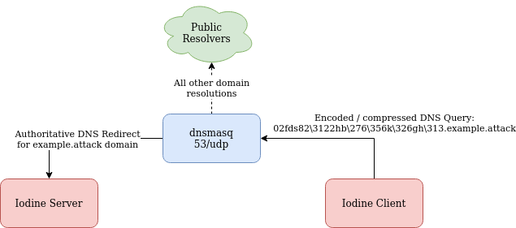

# DNS Tunnel
```
dns_tunnel/                 # Main scenario directory
├── dns_servers             # Scenario component: DNS Server
│   ├── bind9.yaml          # Implementation specific parameters. e.g. Installation commands, log file locations.
│   └── dnsmasq.yaml        # 
├── dns_tunnels             # Scenario component: DNS tunnelling software
│   ├── dnscat.yaml         # Implementation specific parameters. e.g. Installation commands, variables, initiating commands.
│   └── iodine.yaml         # 
└── dns_tunnel.yaml.j2      # Main scenario description file.
```

## Description
This directory contains DNS tunnel scenario description files.

## Components
### DNS Servers
* <a href="https://thekelleys.org.uk/dnsmasq/doc.html">Dnsmasq</a>
* <a href="https://www.isc.org/bind/">Bind9</a>
* <a href="https://docs.microsoft.com/en-us/windows-server/networking/dns/dns-top">Windows Server DNS</a>
* <a href="https://www.powerdns.com/">PowerDNS</a>
* <a href="https://www.nlnetlabs.nl/projects/unbound/about/">Unbound</a>
* <a href="https://coredns.io/">CoreDNS</a>

### DNS Tunnel
* <a href="https://github.com/yarrick/iodine">Iodine</a>
* <a href="https://github.com/iagox86/dnscat2">DNScat</a>
* <a href="https://github.com/xant/heyoka-unix">Heyoka</a>, <a href="http://heyoka.sourceforge.net/">here</a>, <a href="https://www.youtube.com/watch?v=z8-cG0GZQ_I">here</a> and <a href="http://heyoka.sourceforge.net/heyoka-shakacon2009.pdf">here</a>(uses source ip spoofing)
* <a href="https://github.com/mdornseif/DeNiSe">DeNiSe</a>
* <a href="https://github.com/FedericoCeratto/dnscapy">dnscappy</a>
* <a href="https://github.com/alex-sector/dns2tcp">dns2tcp</a>
* <a href="https://github.com/M66B/element53">Element53</a>
* <a href="https://github.com/lnussbaum/tuns">tuns</a>


## Overview
# <a href="https://github.com/Korving-F/iodine-log-analysis"></a>

## References
* https://github.com/Korving-F/iodine-log-analysis
